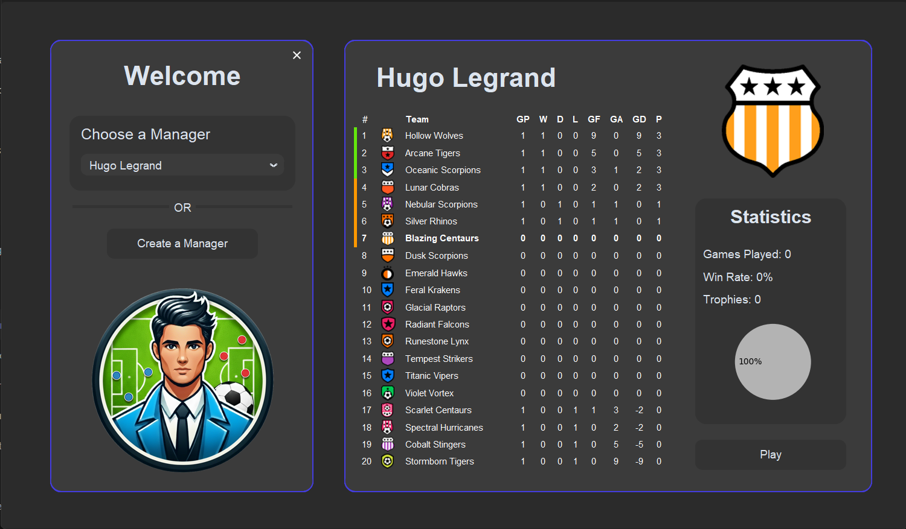
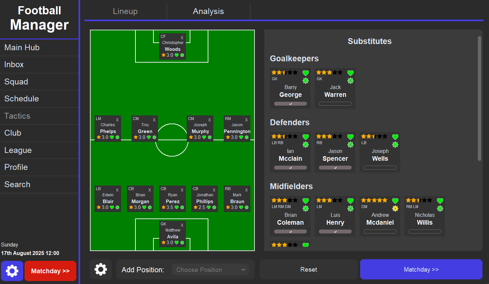
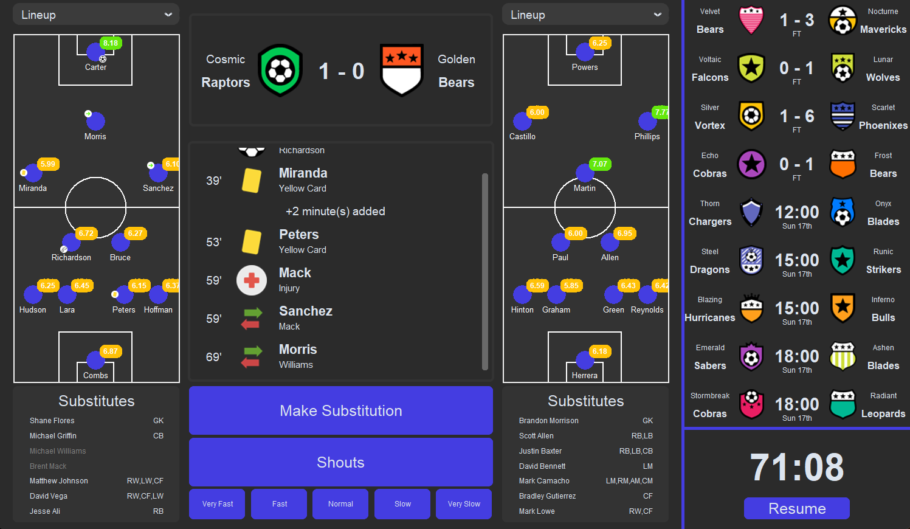

# Football-Manager

🌟 **Started**: December 2024  
🚀 **Status**: In development  

This project is an extension of my previous project, **Football League Simulator**, and brings a more immersive experience to football management. It combines strategy, team management, and in-depth statistics to create an engaging simulation for users.  

---

## 🎯 Current Features

- 🧑‍💼 **Manager Creation**: Create a manager profile and select a team to manage.  
- 📋 **Team Tactics**: Design and implement tactics to optimize team performance during games.  
- ⚡ **Real-Time Decisions**: Make tactical decisions during matches, such as substitutions, formations, and shouts, dynamically influencing match outcomes, player performance, and overall team success.  
- 📊 **Comprehensive Statistics**: View detailed stats for individual players, your team, and the league you participate in.  
- 🌐 **Multiple Leagues**: Play across **8 leagues**, each with **4 divisions**, totaling **640 playable teams**.
- 🏃‍♂️ **Enhanced Match Algorithm**: Match outcomes now consider **player morale, fitness, sharpness, and team lineups in real-time**, adjusting dynamically as the game progresses.  

---

## 🚀 Planned Features

- 💰 **Player Contracts and Transfers**: Implement a detailed transfer system and player contracts to enhance team-building strategies.  
- 🔄 **Manager Career Progression**: Enable managers to switch teams during their careers.  
- 🧮 **Enhanced Analytics**: Add **season-ending calculations**, historical data visualizations for past seasons, and in-depth player attributes.  
- 🏆 **Cup Competitions**: Introduce knockout tournaments and other cup formats.  

---

## 🛠️ Technical Details

- **Built with Tkinter**  
  - Provides a responsive and user-friendly graphical interface for managing teams, viewing stats, and interacting with matches in real-time.  

- **SQL Database for Data Management**  
  - Player, team, match, league data and more are stored in a structured SQL database.  
  - Supports efficient queries for league tables, player stats, match history, and team lineups.  

- **Enhanced Match Outcome Algorithm**  
  - Outcomes consider multiple **dynamic factors**:  
    - **Player Morale** – Players’ confidence affects performance and consistency.  
    - **Fitness** – Fatigue and stamina influence effectiveness on the pitch.  
    - **Sharpness** – Recent form and match readiness affect decisions and goal-scoring ability.  
    - **Team Lineups** – Formation and selected players dynamically affect both attack and defense.  
    - **Tactical Decisions** – Substitutions, formation changes, and shouts influence performance in real-time.  
  - **Player Attributes**: Each position (defender, midfielder, forward) has individual attributes impacting contribution.  
  - **Dynamic Events**: As the game progresses, player stats, morale, and lineups update based on in-game events.  
  - **Stats Calculation**: Statistics (goals, fouls, ...) are influenced by the above factors.  

- **Scalable Design**  
  - Supports **8 leagues with 4 divisions each (640 teams)**.  
  - Players can choose which leagues to load, improving performance while maintaining realism.  
  - Structured to allow future expansions like cup competitions, player transfers, and career progression.  

## 📸 Screenshots

Here are some screenshots from the project (as of 21/10/25):

  
  
  

  
  
  

  
  
  

  
  
  

